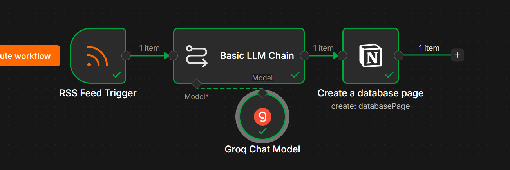

# 📰 Project 4: RSS AI News Digest (Notion Edition)

A simpler n8n automation that checks BBC Technology news every hour, summarizes new articles using AI, and automatically saves them into a Notion database — fully hands-free once activated.

---

## 📌 What This Project Does

This workflow automatically:
1. Checks the BBC Technology RSS feed every hour for new articles
2. Summarizes each new article into 3 factual bullet points using AI
3. Saves the title, summary, URL, and date as a new row in a Notion database

Once activated, it runs forever with zero manual work.

---

## ⚙️ How It Works (Workflow)

RSS Feed Trigger (BBC Technology, polls every 1 hour, max 5 items)
↓
Basic LLM Chain → Groq (openai/gpt-oss-20b)
↓
(Summarizes article into exactly 3 bullet points)
↓
Notion Node → Create Database Page
↓
(Saves Title, Summary, URL, Date)

---

## 🛠️ Tech Stack

| Tool | Purpose |
|------|---------|
| **n8n** | Workflow automation |
| **RSS Feed Trigger** | Monitors BBC Technology news |
| **Google Gemini** | AI summarization (3-bullet-point format) |
| **Notion** | Stores structured article summaries |

---

## 🗂️ Notion Database Setup

| Column | Type |
|--------|------|
| Title | Text |
| Summary | Text |
| URL | URL |
| Date | Date |

---

## 📷 Screenshots

*Full n8n workflow canvas*

*Article summaries saved in the Notion database*

---

## 🎯 What I Learned

- Connecting Notion as a database backend using an Integration Token
- Polling an RSS feed on a schedule and limiting items processed
- Writing a strict system prompt to control AI output format (exactly 3 bullet points, no opinions)
- Mapping RSS + AI output fields into a structured Notion database

---

## 👤 Author

Built by Abdullah as part of a self-directed AI Automation learning program.
